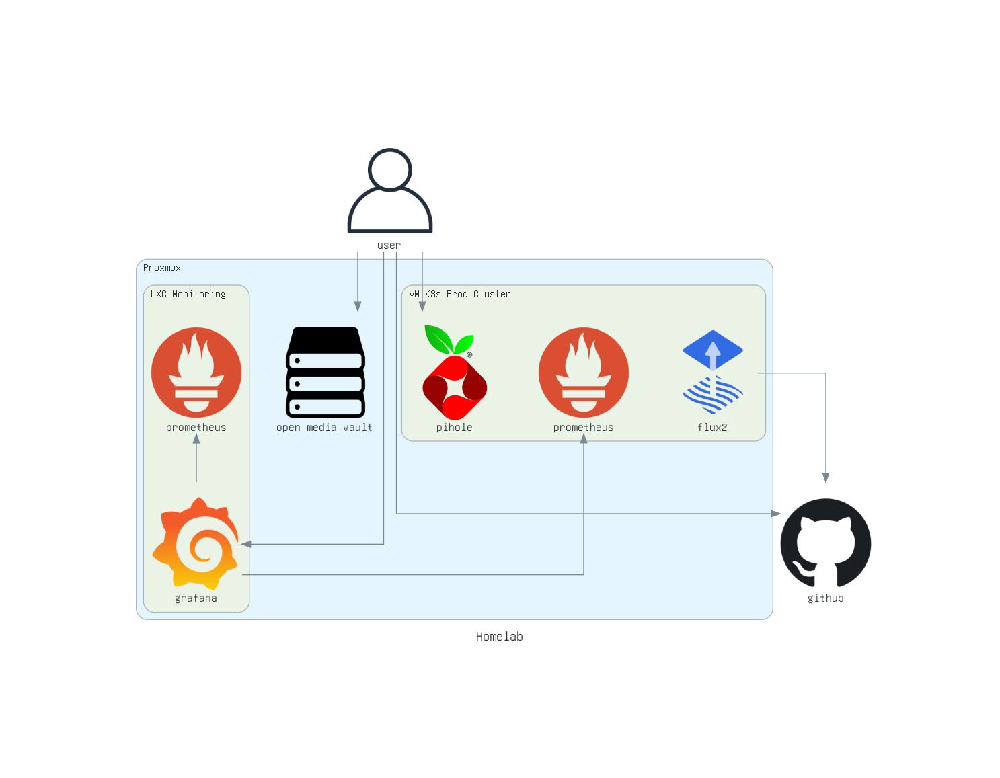

# Homelab

このリポジトリは自宅サーバーの基盤関係のリソースをまとめています。

## セットアップ手順

```bash
docker build -t homelab-docker .

docker run -it --rm -v "$(pwd)":/workspace -w /workspace homelab-docker
# windows
# MSYS_NO_PATHCONV=1 docker run -it --rm -v "$(pwd)":/workspace -w /workspace homelab-docker
```

## 環境情報



### ハードウェア

- `GMKtec G3 Plus`
  - CPU: `Alder Lake-Nシリーズ N100`
  - RAM: ~~`16GB`~~ `32GB`
  - SSD: `256GB`
