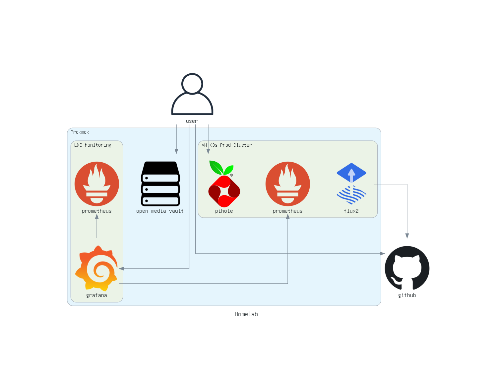

# Homelab

このリポジトリは自宅サーバーの基盤関係のリソースをまとめています。

## セットアップ手順

### 前提条件

このプロジェクトを動かすには、以下のツールがインストールされている必要があります。

- Nix
- direnv

### 環境の起動

```bash
echo "use flake\ndotenv" >> .envrc
direnv allow
```

## 環境情報



### ハードウェア

- `GMKtec G3 Plus`
  - CPU: `Alder Lake-Nシリーズ N100`
  - RAM: ~~`16GB`~~ `32GB`
  - SSD: `256GB`
